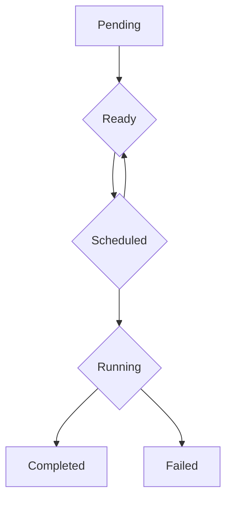

# Secure Scheduler Design

This document outlines the design of the Secure Scheduler for the UCQCF Core Execution Engine (CEE).

## 1. Task State Machine

The lifecycle of a `Task` within the CEE is governed by the following state machine. The scheduler is responsible for transitioning tasks between these states.



- **Pending:** The task has been submitted to the engine but has not yet been validated or queued.
- **Ready:** The task has been validated and is in a queue, waiting to be scheduled on a `CoreGroup`.
- **Scheduled:** The scheduler has assigned the task to a specific `CoreGroup` and a specific CPU core within that group.
- **Running:** The task is actively being executed by a worker thread on its assigned core.
- **Completed:** The task has finished successfully.
- **Failed:** The task terminated with an error.

## 2. Core Pinning and Isolation Rules

The fundamental security guarantee of the scheduler is **security by topology**. This is enforced by a strict set of rules that govern where tasks can be scheduled.

1.  **Strict Domain Isolation:** A `Task` with a given `SecurityDomain` (e.g., `Defense`) **must** be scheduled on a `CoreGroup` that is designated for that same `SecurityDomain`.
2.  **No Cross-Domain Sharing:** Unless explicitly configured for a mixed-workload `CoreGroup`, tasks from different security domains **must never** share the same physical CPU core.
3.  **Affinity Enforcement:** The scheduler **must** respect the `Affinity` of a `Task`. A task with `Affinity::Fpga` should not be scheduled on a CPU core, but rather offloaded to a dedicated FPGA pipeline.
4.  **Core Pinning:** Once a task is `Scheduled` to a specific CPU core, the worker thread executing that task **must** be pinned to that core to prevent the OS from migrating it. This is critical for preventing cache-based side-channel attacks.

## 3. Scheduler Data Structures

The `SecureScheduler` will use the following data structures to manage its state:

```rust
use crate::task::Task;
use crate::domain::CoreGroup;
use std::collections::{HashMap, VecDeque};

pub struct SecureScheduler {
    /// The queues of tasks that are ready to be scheduled.
    /// There is a separate queue for each `SecurityDomain`.
    ready_queues: HashMap<SecurityDomain, VecDeque<Task>>,
    /// The set of configured `CoreGroup`s.
    core_groups: Vec<CoreGroup>,
    // Additional fields for managing worker threads, etc.
}
```

This design ensures that the scheduler's core logic is directly tied to the security architecture of the CEE, providing a strong foundation for a high-performance, secure execution fabric.
